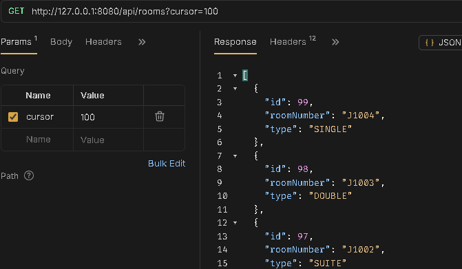
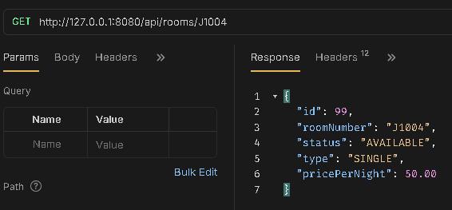
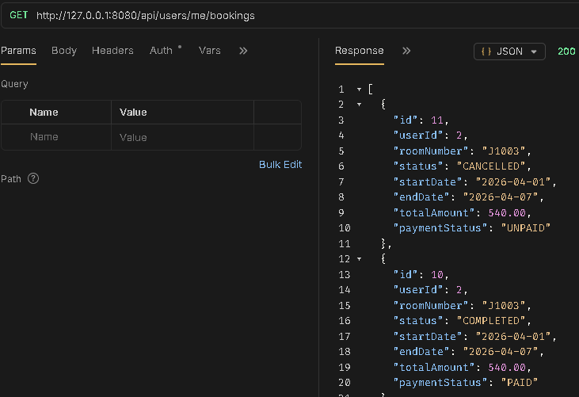
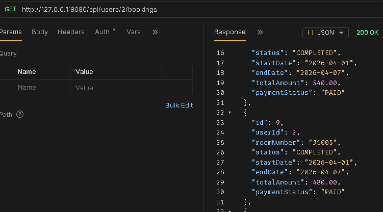
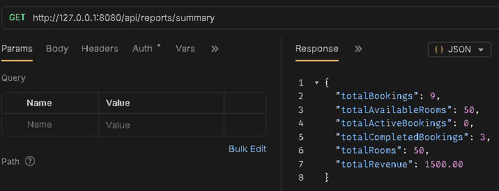

# Room Booking System API

This is a RESTful API for a Room Reservation System built with Spring Boot and PostgreSQL, enabling users to create, read, update, and delete reservations efficiently. It combines Spring Boot’s structured architecture with PostgreSQL’s reliable data storage for seamless reservation management.

  
  
  
  
  
  

---

## 🚀 Tech Stack & Architecture

- **Spring Boot**: Handles HTTP requests and manages application components for a robust API framework.
- **Spring Security**: Secures the API endpoints with authentication and authorization mechanisms.
- **Spring Data JPA**: Simplifies database interactions and provides an abstraction layer over Hibernate.
- **Spring Session Redis**: Manages user sessions efficiently, allowing for scalable session handling.
- **PostgreSQL**: Stores reservation data reliably with strong data integrity.
- **Redis**: Caches frequently accessed data to improve performance and reduce load.
- **Docker**: Containerizes the application for consistent deployment across environments.
- **JUnit 5**: Provides a testing framework for unit and integration tests to ensure code quality and reliability.
- **Mockito**: Used for mocking dependencies in unit tests, allowing for isolated testing of components.
- **Vertical Slice Architecture**: Organizes features into modular slices with all necessary components per functionality.

---

## 📦 Features

- **User Booking Management**: Guests can create, view, update, and cancel their own reservations.
- **Admin Dashboard Operations**: Manage users, bookings, and rooms with elevated privileges.
- **Role-Based Access Control (RBAC)**: Supports `guest` and `admin` roles; admins can view all user's bookings.
- **Reporting**: Generate reports on revenue(total, monthly, etc), room availability, total bookings, and total rooms, etc.
- **Cursor-based Pagination**: Efficiently browse rooms with paginated results.
- **Check-In/Check-Out Dates**: Track and manage reservation dates accurately.
- **Cached Data**: Frequently accessed information is stored temporarily to provide faster responses.
- **Google Recaptcha**: Protects the API from bots and ensures that only human users can access certain endpoints. (with WebClient)

---

## 📸 Sample API Endpoints and Responses

### Room List and Info with Pagination

### Bookings

### Reports

---

## ⚠️ Notes

- This project is focused on backend development, and does not include a frontend interface. It is designed to be consumed by a frontend application or used for API testing and integration purposes.
- It is also for project learning and development, and may not be suitable for production use without considering additional factors. 
- Online payment gateways(e.g Stripe) are out of scope due to regional availability constraints, and the project is focused on Backend logic and API development.

---

## 🧠 Backend Practices

- **N+1 Query Prevention**: Eliminated via LAZY loading + EntityGraph for optimized fetch plans.
- **Efficient Data Access**: Proper indexing and query design to reduce DB load.
- **Caching Strategy**: Redis used to cache frequently accessed data.
- **Room Concurrency Safe**: Uses conditional updates (optimistic concurrency pattern) to ensure only one successful booking per room.
- **Cursor-based Pagination**: Enables efficient and scalable room listing by loading records in chunks using cursors instead of fetching all at once.
- **Global Exception Handling**: Centralized error handling for consistent API responses.
- **RBAC Enforcement**: Secured endpoints based on user roles (guest/admin).
- **Testing**: Unit tests with JUnit 5 and Mockito to ensure code quality and reliability. (Booking service and Room service only)

## 🛠️ Setup Instructions
- Clone repository 
- Configure environment variables in application.yml (or .env for your docker-compose)
- Run `docker compose up` to start the application
